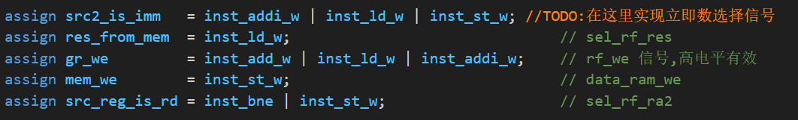
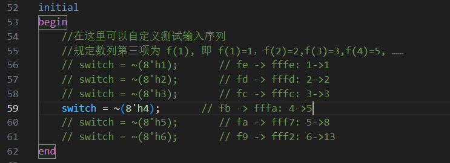
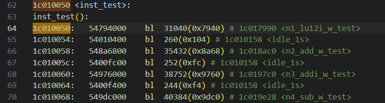
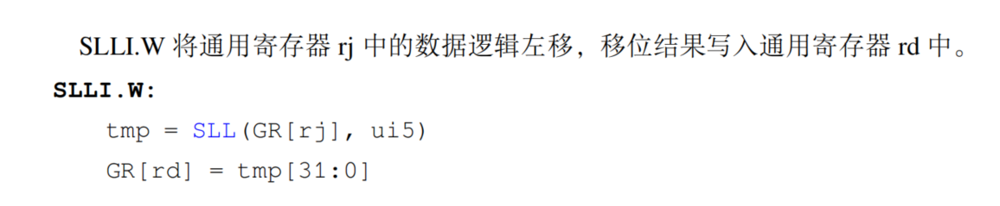
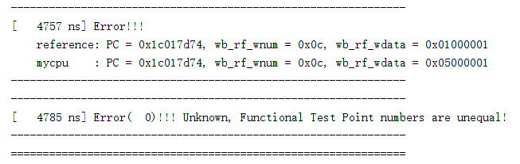

# LOONARCH-CPU Course Design

## exp5

> 代码填空，实现5条指令的单周期CPU

### 1.补充inst_st_w信号


查阅龙芯32位架构参考手册的指令码部分：


查询到ST.W的指令码为 **0010100110** ，占总inst指令的31~22位

因此只需满足31到26位为001010，即op_31_26_d[6'h0a]为1

且25到22位为0110，即op_25_22_d[4'h6]为1


```verilog
assign inst_st_w   = op_31_26_d[6'h0a] & op_25_22_d[4'h6];//TODO:在这里实现inst_st_w指令的译码
```

### 2.src2_is_imm信号



根据指导手册提供的CPU控制信号生成列表如下：


代码中的src2_is_imm信号对应sel_adder_src2信号，即：

```verilog
assign src2_is_imm   = inst_addi_w | inst_ld_w | inst_st_w; //TODO:在这里实现立即数选择信号
```

### 3.补充regfile的信号


根据要求填充regfile的引脚

分析69页的架构图：


rdata1对应rj_value

rdata2对应rkd_value

raddr2为经过rk和rd经过sel_rf_ra2选择后的结果

补充代码如下：

```verilog
assign rf_raddr1 = rj;
assign rf_raddr2 = src_reg_is_rd ? rd :rk;
regfile u_regfile(
    .clk    (clk      ),
    .raddr1 (rf_raddr1),
    .rdata1 (rj_value ),
    .raddr2 (rf_raddr2),
    .rdata2 (rkd_value),
    .we     (gr_we    ),
    .waddr  (rd       ),
    .wdata  (rf_wdata )
    );//TODO:在空出的括号里完成引脚匹配
```

### 4.br_offs信号补充


exp5的跳转指令只有bne一条

查找指令手册：


由于i16存储offs[15:0]的信息，所以只需将i16补充低2位进行四字节对齐，高位补充符号位，代码如下：

```verilog
assign br_offs   = {{14{i16[4'hf]}},i16,2'h0};//TODO:在这里完成br_offs信号的生成
```

### 5.nextpc补充


根据是否跳转的选择信号br_taken选择nextpc的地址：

若跳转，则nextpc为br_target，否则为pc + 4:

```verilog
assign nextpc    = br_taken ? br_target : pc + 3'h4;//TODO:在这里实现nextpc信号的生成
```

### 6.alu_src2补充


根据src2是否为立即数的选择信号src2_is_imm选择alu_src2的值：

```verilog
assign alu_src2 = src2_is_imm ? imm : rkd_value;//TODO:在这里实现alu_src2信号
```

### 7.rf_wdata补充


写回寄存器的值，根据结果是否来自内存（res_from_mem）判断。

```verilog
assign rf_wdata = res_from_mem ? data_sram_rdata : alu_result;//TODO:在这里完成写回寄存器值的选择
```

### 仿真、上板验证

修改仿真文件mycpu_tb.v,自定义测试输入序列

> 注意：为了适应龙芯实验箱的led和switch的布局，仿真时需要将输入信号switch按位取反，得到的led输出结果也需要按位取反。因为拨码开关0上1下，led灯1灭0亮

测试f(1):


测试f(2):


测试f(3):


 


测试f(4):




这里修改完拨码后忘记reset了,led灯的显示没更新。。。

测试f(5):


测试f(6):


## exp6

> 代码改错，实现拓展到20条指令的单周期CPU

首先不做任何修改，建立工程直接进行仿真：

查看tcl console中的trace信息


debug_wb_pc的值一直为未知（x），说明可能是寄存器写回时trace debug接口有问题，或者是程序中PC的跳转逻辑有问题。

检查mycpu_top.v代码:


发现接口中给定的debug使能接口命名为 debug_wb_re_we, 而定义时写成了debug_wb_re_wen

271行修改为：

```verilog
assign debug_wb_rf_we    = {4{rf_we}};
```

重新仿真：


可以发现之前debug_wb_pc=0xxxxxxxxx的问题已经解决，但遇到新的报错：执行PC为0x1c000000时的指令时写回0x0c寄存器的数据错误。

我们可以通过分析原汇编代码来定位这个问题

打开mycpu_env/func/obj/目录下的指令汇编文件test.s:


发现PC为0x1c000000时的指令为：

```assembly
addi.w	$r12,$r0,-1(0xfff)
```

因此判断执行加法时出现了问题，所以将目标定位到ALU部分：

经过检查代码，我发现mycpu_top.v中对alu进行实例化的代码有问题：


输入的两个alu_src都赋值了alu_src2，于是进行如下修改：

```verilog
alu u_alu(
    .alu_op     (alu_op    ),
    .alu_src1   (alu_src1  ),
    .alu_src2   (alu_src2  ),
    .alu_result (alu_result)
    );
```

重新仿真：


发现写回的数据wb_rf_wdata从之前的0x00000000变为0x00000001,结果还是不对，继续排查alu加法部分代码的问题和debug trace 接口的问题：


发现debug_wb_rf_wdata接口连接final_result这个变量，但final_result变量并未进行声明，添加声明代码：

```verilog
wire [31:0] final_result;
```


查看指令手册ADDI.W:


可以发现ADDI.W指令的立即数si12在21~10位

检查代码中对立即数的赋值：


可以发现无论指令的立即数格式为si12还是ui5，都按si12格式进行了赋值，修改如下：

```verilog
assign imm = src2_is_4 ? 32'h4                      :
             need_si20 ? {i20[19:0], 12'b0}         :
             need_ui5  ? rk                         :
            /*need_si12*/{{20{i12[11]}}, i12[11:0]} ;
```

重新仿真：


可以发现之前的问题解决了，但出现了新的错误：原本在PC = 0x1c010050处应该进行寄存器写回操作但并未正常写回

定位到test.s汇编文件对应部分：



发现是bl跳转指令，查看手册：


发现BL指令是有写回寄存器的操作的

检查源代码mycpu_top.v：


寄存器写入使能信号gr_we中将inst_bl排除了，因此修改为：

```verilog
assign gr_we         = ~inst_st_w & ~inst_beq & ~inst_bne & ~inst_b;
```

重新仿真：


解决之前的报错，且又有新的报错：PC = 0x1c017d70的位置写回的数据不正确

汇编文件定位：


定位到指令：

```assembly
slli.w	$r13,$r23,0x18
```

查看手册：



查看源码alu.v:


发现两个操作数的位置弄反了，代码修改为：

```verilog
// SLL result
assign sll_result = alu_src1 << alu_src2;   //rj << ui5
```

重新仿真：



发现结果还是不对

继续检查代码alu.v:


发现这里的alu_src也写反了，且sr64_result的位数写错，修改为：

```verilog
// SRL, SRA result
assign sr64_result = {{32{op_sra & alu_src1[31]}}, alu_src1[31:0]} >> alu_src2[4:0]; //rj >> i5

assign sr_result   = sr64_result[31:0];
```

这部分代码是将算数右移和逻辑右移的结果合并处理：

将原来的rj从32位扩充到64位，仅当是算数右移且rj最高位为1时扩充1，否则扩充0，对扩充后的结果进行逻辑右移操作，结果的第32位就是SRL和SRA运算的结果。

重新仿真：


成功解决之前的问题，新错误位于：0x1c017d74


发现是or指令，定位到alu.v:


发现or_result运算的逻辑错误，修改为：

```verilog
assign or_result  = alu_src1 | alu_src2;
```

重新仿真：


成功PASS！！！

上板验证通过。

## exp7

> 代码添加，实现20条指令的多周期CPU

首先进行STFW(Search The Friendly Web)，对单周期、多周期以及流水线CPU的概念进行了解，并参考流水线CPU的实现。

#### 单周期，多周期以及流水线的对比

设定程序为执行三条指令：

```verilog
addi.w
ld.w
b
```

指导书给的参考为5阶段：IF（取指）、ID（译码）、EXE（执行）、MEM（访存）和WB（写回）

| 指令        | if | id | exe | mem | wb | 阶段数 |
| ----------- | -- | -- | --- | --- | -- | ------ |
| inst_addi_w | 1  | 1  | 1   |     | 1  | 4      |
| inst_ld_w   | 1  | 1  | 1   | 1   | 1  | 5      |
| inst_b      | 1  | 1  |     |     |    | 2      |


**单周期**：每个指令都在一个时钟周期内完成，设计相对简单，不需要复杂的控制逻辑，缺点在于指令的所有操作都在一个时钟周期运行，如果CPU频率要求高且有时序约束，就容易造成时序路径过长带来的时序问题，效率低下。

**多周期**：将指令划分为多个阶段，根据指令的性质选择要执行的阶段，可以很好的优化执行效率，去掉指令不需要的阶段的计算过程，但也加大了执行所需的时钟周期，有时比单周期效率更低。

**流水线**：在多周期的基础上加上并行化处理，既能优化，也比多周期大大减少了运行的时钟周期数，效率最高。

### 设计多阶段状态转移

#### 状态转化图


因为划分了多周期，不同指令所需经过的阶段不同：

| 指令         | if | id | exe | mem | wb | 阶段数 |
| ------------ | -- | -- | --- | --- | -- | ------ |
| inst_add_w   | 1  | 1  | 1   |     | 1  | 4      |
| inst_sub_w   | 1  | 1  | 1   |     | 1  | 4      |
| inst_slt     | 1  | 1  | 1   |     | 1  | 4      |
| inst_sltu    | 1  | 1  | 1   |     | 1  | 4      |
| inst_nor     | 1  | 1  | 1   |     | 1  | 4      |
| inst_and     | 1  | 1  | 1   |     | 1  | 4      |
| inst_or      | 1  | 1  | 1   |     | 1  | 4      |
| inst_xor     | 1  | 1  | 1   |     | 1  | 4      |
| inst_slli_w  | 1  | 1  | 1   |     | 1  | 4      |
| inst_srli_w  | 1  | 1  | 1   |     | 1  | 4      |
| inst_srai_w  | 1  | 1  | 1   |     | 1  | 4      |
| inst_addi_w  | 1  | 1  | 1   |     | 1  | 4      |
| inst_ld_w    | 1  | 1  | 1   | 1   | 1  | 5      |
| inst_st_w    | 1  | 1  | 1   | 1   |    | 4      |
| inst_jirl    | 1  | 1  | 1   |     | 1  | 4      |
| inst_b       | 1  | 1  |     |     |    | 2      |
| inst_bl      | 1  | 1  | 1   |     | 1  | 4      |
| inst_beq     | 1  | 1  | 1   |     |    | 3      |
| inst_bne     | 1  | 1  | 1   |     |    | 3      |
| inst_lu12i_w | 1  | 1  | 1   |     | 1  | 4      |

### 代码编写

> 在单周期代码的基础上进行五个阶段的划分，将代码逻辑划分为5个模块：

#### if_stage.v

```verilog
`include "head.h"
module if_stage(
    input         clk,
    input         reset,
    input  [ 3:0] state,
    output [ 3:0] next_state,
    input  [32:0] br_bus,          // {br_taken, br_target}

    // to ds
    output        fs_to_ds_valid ,
    output [31:0] fs_to_ds_bus,    // {fs_pc}

    // inst sram interface
    output        inst_sram_en,
    output [ 3:0] inst_sram_we,
    output [31:0] inst_sram_addr,
    output [31:0] inst_sram_wdata
);
wire valid;
assign valid = state == `STATE_IF;

wire [31:0] seq_pc;
wire [31:0] nextpc;

wire         br_taken;
wire [ 31:0] br_target;
assign {br_taken, br_target} = br_bus;

reg  [31:0] fs_pc;

assign fs_to_ds_valid = valid;
assign fs_to_ds_bus = {nextpc};

assign seq_pc       = fs_pc + 3'h4;
assign nextpc       = br_taken ? br_target : seq_pc; 

assign next_state = reset? `STATE_IF:
                    valid? `STATE_ID:
                    `STATE_IF;

always @(posedge clk) begin
    if (reset) begin
        // fs_pc <= 32'h1c000000;
        fs_pc <= 32'h1bfffffc;     //trick: to make nextpc be 0x1c000000 during reset 
    end
    else if(valid) begin 
        fs_pc <= nextpc;
    end
end

assign inst_sram_en    = 1;
assign inst_sram_we    = 4'h0;
assign inst_sram_addr  = nextpc;
assign inst_sram_wdata = 32'b0;

// assign fs_inst         = inst_sram_rdata;

endmodule
```

在state为IF时生效，执行取指操作，并更新PC，将PC的值传到总线fs_to_ds_bus，设定总线有效信号fs_to_ds_valid为真，设定inst_ram的读地址(由于使用的是同步读ram，数据将在下一个时钟上升沿读到inst_ram_rdata，所以会在之后的ID state读到正确的指令数据)，更新next_state为ID。

#### id_stage.v

```verilog
`include "head.h"
module id_stage(
    input         clk           ,
    input         reset         ,
    // state
    input  [3:0]  state         ,
    output [3:0]  next_state    ,
    //from fs
    input         fs_to_ds_valid,
    input [31:0]  fs_to_ds_bus  ,
    //to es
    output         ds_to_es_valid,
    output [151:0] ds_to_es_bus ,
    //to fs
    output [32:0] br_bus        ,
    //to rf: for write back
    input  [37:0] ws_to_rf_bus,

    input [31:0] inst_sram_rdata
);

wire valid;
assign valid = state == `STATE_ID;

wire        br_taken;
reg         br_taken_r;
wire [31:0] br_target;
reg  [31:0] br_target_r;
 
wire [31:0] ds_pc;
wire [31:0] ds_inst;

wire [11:0] alu_op;

wire        load_op;
wire        src1_is_pc;
wire        src2_is_imm;
wire        res_from_mem;
wire        dst_is_r1;
wire        gr_we;
wire        mem_we;
wire        src_reg_is_rd;
wire [4: 0] dest;
wire [31:0] rj_value;
wire [31:0] rkd_value;
wire [31:0] imm;
wire [31:0] br_offs;
wire [31:0] jirl_offs;

wire [ 5:0] op_31_26;
wire [ 3:0] op_25_22;
wire [ 1:0] op_21_20;
wire [ 4:0] op_19_15;
wire [ 4:0] rd;
wire [ 4:0] rj;
wire [ 4:0] rk;
wire [11:0] i12;
wire [19:0] i20;
wire [15:0] i16;
wire [25:0] i26;

wire [63:0] op_31_26_d;
wire [15:0] op_25_22_d;
wire [ 3:0] op_21_20_d;
wire [31:0] op_19_15_d;

wire        inst_add_w;
wire        inst_sub_w;
wire        inst_slt;
wire        inst_sltu;
wire        inst_nor;
wire        inst_and;
wire        inst_or;
wire        inst_xor;
wire        inst_slli_w;
wire        inst_srli_w;
wire        inst_srai_w;
wire        inst_addi_w;
wire        inst_ld_w;
wire        inst_st_w;
wire        inst_jirl;
wire        inst_b;
wire        inst_bl;
wire        inst_beq;
wire        inst_bne;
wire        inst_lu12i_w;

wire        need_ui5;
wire        need_si12;
wire        need_si16;
wire        need_si20;
wire        need_si26;
wire        src2_is_4;

wire [ 4:0] rf_raddr1;
wire [31:0] rf_rdata1;
wire [ 4:0] rf_raddr2;
wire [31:0] rf_rdata2;

wire        rf_we   ;
wire [ 4:0] rf_waddr;
wire [31:0] rf_wdata;

wire [31:0] alu_src1   ;
wire [31:0] alu_src2   ;
wire [31:0] alu_result ;

wire [31:0] mem_result;
wire [31:0] final_result;


assign op_31_26  = ds_inst[31:26];
assign op_25_22  = ds_inst[25:22];
assign op_21_20  = ds_inst[21:20];
assign op_19_15  = ds_inst[19:15];

assign rd   = ds_inst[ 4: 0];
assign rj   = ds_inst[ 9: 5];
assign rk   = ds_inst[14:10];

assign i12  = ds_inst[21:10];
assign i20  = ds_inst[24: 5];
assign i16  = ds_inst[25:10];
assign i26  = {ds_inst[ 9: 0], ds_inst[25:10]};

decoder_6_64 u_dec0(.in(op_31_26 ), .out(op_31_26_d ));
decoder_4_16 u_dec1(.in(op_25_22 ), .out(op_25_22_d ));
decoder_2_4  u_dec2(.in(op_21_20 ), .out(op_21_20_d ));
decoder_5_32 u_dec3(.in(op_19_15 ), .out(op_19_15_d ));

assign inst_add_w  = op_31_26_d[6'h00] & op_25_22_d[4'h0] & op_21_20_d[2'h1] & op_19_15_d[5'h00];
assign inst_sub_w  = op_31_26_d[6'h00] & op_25_22_d[4'h0] & op_21_20_d[2'h1] & op_19_15_d[5'h02];
assign inst_slt    = op_31_26_d[6'h00] & op_25_22_d[4'h0] & op_21_20_d[2'h1] & op_19_15_d[5'h04];
assign inst_sltu   = op_31_26_d[6'h00] & op_25_22_d[4'h0] & op_21_20_d[2'h1] & op_19_15_d[5'h05];
assign inst_nor    = op_31_26_d[6'h00] & op_25_22_d[4'h0] & op_21_20_d[2'h1] & op_19_15_d[5'h08];
assign inst_and    = op_31_26_d[6'h00] & op_25_22_d[4'h0] & op_21_20_d[2'h1] & op_19_15_d[5'h09];
assign inst_or     = op_31_26_d[6'h00] & op_25_22_d[4'h0] & op_21_20_d[2'h1] & op_19_15_d[5'h0a];
assign inst_xor    = op_31_26_d[6'h00] & op_25_22_d[4'h0] & op_21_20_d[2'h1] & op_19_15_d[5'h0b];
assign inst_slli_w = op_31_26_d[6'h00] & op_25_22_d[4'h1] & op_21_20_d[2'h0] & op_19_15_d[5'h01];
assign inst_srli_w = op_31_26_d[6'h00] & op_25_22_d[4'h1] & op_21_20_d[2'h0] & op_19_15_d[5'h09];
assign inst_srai_w = op_31_26_d[6'h00] & op_25_22_d[4'h1] & op_21_20_d[2'h0] & op_19_15_d[5'h11];
assign inst_addi_w = op_31_26_d[6'h00] & op_25_22_d[4'ha];
assign inst_ld_w   = op_31_26_d[6'h0a] & op_25_22_d[4'h2];
assign inst_st_w   = op_31_26_d[6'h0a] & op_25_22_d[4'h6];
assign inst_jirl   = op_31_26_d[6'h13];
assign inst_b      = op_31_26_d[6'h14];
assign inst_bl     = op_31_26_d[6'h15];
assign inst_beq    = op_31_26_d[6'h16];
assign inst_bne    = op_31_26_d[6'h17];
assign inst_lu12i_w= op_31_26_d[6'h05] & ~ds_inst[25];

assign alu_op[ 0] = inst_add_w | inst_addi_w | inst_ld_w | inst_st_w
                    | inst_jirl | inst_bl;
assign alu_op[ 1] = inst_sub_w;
assign alu_op[ 2] = inst_slt;
assign alu_op[ 3] = inst_sltu;
assign alu_op[ 4] = inst_and;
assign alu_op[ 5] = inst_nor;
assign alu_op[ 6] = inst_or;
assign alu_op[ 7] = inst_xor;
assign alu_op[ 8] = inst_slli_w;
assign alu_op[ 9] = inst_srli_w;
assign alu_op[10] = inst_srai_w;
assign alu_op[11] = inst_lu12i_w;

assign need_ui5   =  inst_slli_w | inst_srli_w | inst_srai_w;
assign need_si12  =  inst_addi_w | inst_ld_w | inst_st_w;
assign need_si16  =  inst_jirl | inst_beq | inst_bne;
assign need_si20  =  inst_lu12i_w;
assign need_si26  =  inst_b | inst_bl;
assign src2_is_4  =  inst_jirl | inst_bl;

assign imm = src2_is_4 ? 32'h4                      :
             need_si20 ? {i20[19:0], 12'b0}         :
             need_ui5  ? rk                         :
            /*need_si12*/{{20{i12[11]}}, i12[11:0]} ;

assign br_offs = need_si26 ? {{ 4{i26[25]}}, i26[25:0], 2'b0} :
                             {{14{i16[15]}}, i16[15:0], 2'b0} ;

assign jirl_offs = {{14{i16[15]}}, i16[15:0], 2'b0};

assign src_reg_is_rd = inst_beq | inst_bne | inst_st_w;

assign src1_is_pc    = inst_jirl | inst_bl;

assign src2_is_imm   = inst_slli_w |
                       inst_srli_w |
                       inst_srai_w |
                       inst_addi_w |
                       inst_ld_w   |
                       inst_st_w   |
                       inst_lu12i_w|
                       inst_jirl   |
                       inst_bl     ;

assign res_from_mem  = inst_ld_w;
assign dst_is_r1     = inst_bl;
assign gr_we         = ~inst_st_w & ~inst_beq & ~inst_bne & ~inst_b;
assign mem_we        = inst_st_w;
assign dest          = dst_is_r1 ? 5'd1 : rd;

assign rf_raddr1 = rj;
assign rf_raddr2 = src_reg_is_rd ? rd :rk;
regfile u_regfile(
    .clk    (clk      ),
    .raddr1 (rf_raddr1),
    .rdata1 (rf_rdata1),
    .raddr2 (rf_raddr2),
    .rdata2 (rf_rdata2),
    .we     (rf_we    ),
    .waddr  (rf_waddr ),
    .wdata  (rf_wdata )
    );

assign rj_value  = rf_rdata1;
assign rkd_value = rf_rdata2;

assign rj_eq_rd = (rj_value == rkd_value);

always @(posedge clk) begin
    if (reset) begin
        br_taken_r <= 0;
    end
    else if (valid) begin
        br_taken_r <= (   inst_beq  &&  rj_eq_rd
                        || inst_bne  && !rj_eq_rd
                        || inst_jirl
                        || inst_bl
                        || inst_b
                        );

        br_target_r <= (inst_beq || inst_bne || inst_bl || inst_b) ? (ds_pc + br_offs) :
                                                   /*inst_jirl*/ (rj_value + jirl_offs);
    end
  
end
assign br_taken = br_taken_r;

assign br_target = br_target_r;

assign br_bus = {br_taken, br_target}; 
reg  [31:0] fs_to_ds_bus_r;

// assign {ds_inst,
//         ds_pc  } = fs_to_ds_bus_r;
assign ds_pc = fs_to_ds_bus_r;
assign ds_inst = inst_sram_rdata;

assign {rf_we   ,  //37:37
        rf_waddr,  //36:32
        rf_wdata   //31:0
       } = ws_to_rf_bus;

assign ds_to_es_valid = valid;
assign ds_to_es_bus = {alu_op       ,   // 12
                       load_op      ,   // 1
                       src1_is_pc   ,   // 1
                       src2_is_imm  ,   // 1
                       src2_is_4    ,   // 1
                       gr_we        ,   // 1
                       mem_we       ,   // 1
                       dest         ,   // 5
                       imm          ,   // 32
                       rj_value     ,   // 32
                       rkd_value    ,   // 32
                       ds_pc        ,   // 32
                       res_from_mem
                    };

assign next_state = (inst_b) ? `STATE_IF :
                    (inst_beq | inst_bne) ? `STATE_EX1 :
                    (inst_ld_w) ? `STATE_EX3 :
                    (inst_st_w) ? `STATE_EX4 :
                    `STATE_EX2;

always @(posedge clk) begin
    if (fs_to_ds_valid) begin  
        fs_to_ds_bus_r <= fs_to_ds_bus;
    end
end


endmodule
```

接收IF阶段传递过来的fs_to_ds_bus数据（PC），读取inst_sram_rdata的指令数据，进行译码操作，将译码信号写入总线ds_to_es_bus传递给EXE阶段，如果是跳转指令，需要更新跳转选择信号br_taken以及跳转地址br_target，写入总线br_bus传递给IF阶段，根据状态转换图的设计根据译码出的指令结果设定不同的next_state。

#### EXE_stage

```verilog
`include "head.h"
module exe_stage(
    input                          clk           ,
    input                          reset         ,
    // state
    input  [3:0]                    state        ,
    output [3:0]                    next_state   ,
    //from ds
    input          ds_to_es_valid,
    input  [151:0] ds_to_es_bus  ,
    //to ms
    output         es_to_ms_valid,
    output [ 70:0] es_to_ms_bus  ,
    //to ws
    output         es_to_ws_valid,
    output [ 69:0] es_to_ws_bus  ,
    // data sram interface(write)
    output        data_sram_en   ,
    output [ 3:0] data_sram_we   ,
    output [31:0] data_sram_addr ,
    output [31:0] data_sram_wdata
);

wire valid;
assign valid = (state == `STATE_EX1) || (state == `STATE_EX2) || (state == `STATE_EX3) || (state == `STATE_EX4);

reg  [151:0] ds_to_es_bus_r;

wire [11:0] alu_op      ;
wire        es_load_op;
wire        src1_is_pc;
wire        src2_is_imm;
wire        src2_is_4;
wire        res_from_mem;
wire        dst_is_r1;
wire        gr_we;
wire        es_mem_we;
wire [4: 0] dest;
wire [31:0] rj_value;
wire [31:0] rkd_value;
wire [31:0] imm;
wire [31:0] es_pc;


assign {alu_op,
        es_load_op,
        src1_is_pc,
        src2_is_imm,
        src2_is_4,
        gr_we,
        es_mem_we,
        dest,
        imm,
        rj_value,
        rkd_value,
        es_pc,
        res_from_mem
       } = ds_to_es_bus_r;

always @(posedge clk) begin
    if (ds_to_es_valid) begin
        ds_to_es_bus_r <= ds_to_es_bus;
    end
end

wire [31:0] alu_src1   ;
wire [31:0] alu_src2   ;
wire [31:0] alu_result ;

assign es_to_ms_valid = (state == `STATE_EX3) || (state == `STATE_EX4);
assign es_to_ms_bus = {res_from_mem,  //70:70 1
                       gr_we       ,  //69:69 1
                       dest        ,  //68:64 5
                       alu_result  ,  //63:32 32
                       es_pc          //31:0  32
                      };

assign es_to_ws_valid = (state == `STATE_EX1) || (state == `STATE_EX2);
assign es_to_ws_bus = {gr_we       ,  //69:69 1
                       dest        ,  //68:64 5
                       alu_result  ,  //63:32 32
                       es_pc          //31:0  32
                      };
              
assign alu_src1 = src1_is_pc  ? es_pc  : rj_value;
assign alu_src2 = src2_is_imm ? imm : rkd_value;

assign next_state = (state == `STATE_EX1) ? `STATE_IF:
                    (state == `STATE_EX2) ? `STATE_WB:
                    (state == `STATE_EX3) ? `STATE_MEM1:
                    (state == `STATE_EX4) ? `STATE_MEM2:
                    `STATE_IF;

alu u_alu(
    .alu_op     (alu_op    ),
    .alu_src1   (alu_src1  ),
    .alu_src2   (alu_src2  ),
    .alu_result (alu_result)
    );

assign data_sram_en    = 1'b1;
assign data_sram_we    = es_mem_we && valid ? 4'hf : 4'h0;
assign data_sram_addr  = alu_result;
assign data_sram_wdata = rkd_value;

endmodule
```

执行运算，并传递数据，执行data_ram的写入同时也设定读地址，选择next_state。

#### mem_stage.v

```verilog
`include "head.h"
module mem_stage(
    input         clk           ,
    input         reset         ,
    // state
    input  [3:0]      state         ,
    output [3:0]      next_state    ,
    //from es
    input         es_to_ms_valid,
    input  [70:0] es_to_ms_bus  ,
    //to ws
    output        ms_to_ws_valid,
    output [69:0] ms_to_ws_bus  ,
  
    //from data-sram
    input  [31:0] data_sram_rdata
);

wire valid;
assign valid = (state == `STATE_MEM1) || (state == `STATE_MEM2);

reg  [70:0] es_to_ms_bus_r;
wire        ms_res_from_mem;
wire        ms_gr_we;
wire [ 4:0] ms_dest;
wire [31:0] ms_alu_result;
wire [31:0] ms_pc;

wire [31:0] mem_result;
wire [31:0] ms_final_result;


assign {ms_res_from_mem,  //70:70
        ms_gr_we       ,  //69:69
        ms_dest        ,  //68:64
        ms_alu_result  ,  //63:32
        ms_pc             //31:0
       } = es_to_ms_bus_r;

always @(posedge clk) begin
    if (es_to_ms_valid) begin
        es_to_ms_bus_r <= es_to_ms_bus;
    end
end

assign ms_to_ws_valid = valid;
assign ms_to_ws_bus = {ms_gr_we       ,  //69:69
                       ms_dest        ,  //68:64
                       ms_final_result,  //63:32
                       ms_pc             //31:0
                      };


assign next_state = (state == `STATE_MEM1)? `STATE_WB : `STATE_IF;

assign mem_result   = data_sram_rdata;
assign ms_final_result = ms_res_from_mem ? mem_result : ms_alu_result;

endmodule
```

执行访存，读取data_ram的数据并传递信息

#### wb_stage.v

```verilog
`include "head.h"
module wb_stage(
    input  wire         clk           ,
    input  wire         reset         ,
    // state
    input  wire [3:0]        state         ,
    output wire [3:0]        next_state    ,
    //from ms
    input  wire         ms_to_ws_valid,
    input  wire [69:0]  ms_to_ws_bus  ,
    //from es
    input  wire         es_to_ws_valid,
    input  wire [69:0]  es_to_ws_bus  ,
    //to rf: for write back
    output wire         ws_to_rf_valid,
    output wire [37:0]  ws_to_rf_bus  ,
    //trace debug interface
    output wire [31:0] debug_wb_pc     ,
    output wire [ 3:0] debug_wb_rf_we  ,
    output wire [ 4:0] debug_wb_rf_wnum,
    output wire [31:0] debug_wb_rf_wdata
);

wire valid;
assign valid = state == `STATE_WB;

reg  [69:0] to_ws_bus_r;
wire        ws_gr_we;
wire [ 4:0] ws_dest;
wire [31:0] ws_final_result;
wire [31:0] ws_pc;
assign {ws_gr_we       ,  //69:69
        ws_dest        ,  //68:64
        ws_final_result,  //63:32
        ws_pc             //31:0
       } = to_ws_bus_r;

wire        rf_we;
wire [4 :0] rf_waddr;
wire [31:0] rf_wdata;
assign ws_to_rf_valid = valid;
assign ws_to_rf_bus = {rf_we   ,  //37:37
                       rf_waddr,  //36:32
                       rf_wdata   //31:0
                      };

assign next_state = `STATE_IF;

always @(posedge clk) begin
    if (es_to_ws_valid) begin
        to_ws_bus_r <= es_to_ws_bus;
    end
    else if (ms_to_ws_valid) begin
        to_ws_bus_r <= ms_to_ws_bus;
    end
end

assign rf_we    = ws_gr_we && valid;
assign rf_waddr = ws_dest;
assign rf_wdata = ws_final_result;

// debug info generate
assign debug_wb_pc       = ws_pc;
assign debug_wb_rf_we    = {4{rf_we}};
assign debug_wb_rf_wnum  = ws_dest;
assign debug_wb_rf_wdata = ws_final_result;

endmodule
```

执行写回操作，从总线接受到的信号获取写回信息，对寄存器进行写回，同时更新debug trace的信号。

#### head.h

```verilog
`ifndef HEAD_H
    `define HEAD_H

    `define STATE_IF   4'b0000
    `define STATE_ID   4'b0001
    `define STATE_EX1  4'b0010
    `define STATE_EX2  4'b0011
    `define STATE_EX3  4'b0100
    `define STATE_EX4  4'b0101
    `define STATE_MEM1 4'b0110
    `define STATE_MEM2 4'b0111
    `define STATE_WB   4'b1000

`endif
```

对状态进行编码宏定义

#### mycpu_top.v

```verilog
`include "head.h"

module mycpu_top(
    input  wire        clk,
    input  wire        resetn,
    // inst sram interface
    output wire        inst_sram_en,
    output wire [ 3:0] inst_sram_we,
    output wire [31:0] inst_sram_addr,
    output wire [31:0] inst_sram_wdata,
    input  wire [31:0] inst_sram_rdata,
    // data sram interface
    output wire        data_sram_en,
    output wire [ 3:0] data_sram_we,
    output wire [31:0] data_sram_addr,
    output wire [31:0] data_sram_wdata,
    input  wire [31:0] data_sram_rdata,
    // trace debug interface
    output wire [31:0] debug_wb_pc,
    output wire [ 3:0] debug_wb_rf_we,
    output wire [ 4:0] debug_wb_rf_wnum,
    output wire [31:0] debug_wb_rf_wdata
);
reg         reset;
always @(posedge clk) reset <= ~resetn;

// 多周期
reg [3:0] state;
wire [3:0] next_state_if;
wire [3:0] next_state_id;
wire [3:0] next_state_exe;
wire [3:0] next_state_mem;
wire [3:0] next_state_wb;


always @(posedge clk or posedge reset) begin
    if (reset) begin
        state <= `STATE_IF; // 初始状态
    end else begin
        // 根据实际需求选择 `next_state`
        case (state)
            `STATE_IF: state <= next_state_if;
            `STATE_ID: state <= next_state_id;
            `STATE_EX1,`STATE_EX2,`STATE_EX3,`STATE_EX4: state <= next_state_exe;
            `STATE_MEM1,`STATE_MEM2: state <= next_state_mem;
            `STATE_WB: state <= next_state_wb;
            default: state <= `STATE_IF;
        endcase
    end
end

// 通过总线连接各个模块缓存
wire [ 31:0] fs_to_ds_bus;
wire [151:0] ds_to_es_bus;
wire [ 70:0] es_to_ms_bus;
wire [ 69:0] es_to_ws_bus;
wire [ 69:0] ms_to_ws_bus;
wire [ 37:0] ws_to_rf_bus;
wire [ 32:0] br_bus;

wire fs_to_ds_valid;
wire ds_to_es_valid;
wire es_to_ms_valid;
wire es_to_ws_valid;
wire ms_to_ws_valid;

// IF stage
if_stage if_stage(
    .clk            (clk            ),
    .reset          (reset          ),
    .state          (state          ),
    .next_state     (next_state_if  ),
    //brbus
    .br_bus         (br_bus         ),
    //outputs
    .fs_to_ds_valid (fs_to_ds_valid ),
    .fs_to_ds_bus   (fs_to_ds_bus   ),
    // inst sram interface
    .inst_sram_en   (inst_sram_en   ),
    .inst_sram_we   (inst_sram_we  ),
    .inst_sram_addr (inst_sram_addr ),
    .inst_sram_wdata(inst_sram_wdata)
  
);
// ID stage
id_stage id_stage(
    .clk            (clk            ),
    .reset          (reset          ),
    // state
    .state          (state          ),
    .next_state     (next_state_id  ),
    //from fs
    .fs_to_ds_valid (fs_to_ds_valid ),
    .fs_to_ds_bus   (fs_to_ds_bus   ),
    //to es
    .ds_to_es_valid (ds_to_es_valid ),
    .ds_to_es_bus   (ds_to_es_bus   ),
    //to fs
    .br_bus         (br_bus         ),
    //to rf: for write back
    .ws_to_rf_bus   (ws_to_rf_bus   ),
    .inst_sram_rdata(inst_sram_rdata)
);
// EXE stage
exe_stage exe_stage(
    .clk            (clk            ),
    .reset          (reset          ),
    // state
    .state          (state          ),
    .next_state     (next_state_exe ),
    //from ds
    .ds_to_es_valid (ds_to_es_valid ),
    .ds_to_es_bus   (ds_to_es_bus   ),
    //to ms
    .es_to_ms_valid (es_to_ms_valid ),
    .es_to_ms_bus   (es_to_ms_bus   ),
    //to ws
    .es_to_ws_valid (es_to_ws_valid ),
    .es_to_ws_bus   (es_to_ws_bus   ),
    // data sram interface
    .data_sram_en   (data_sram_en   ),
    .data_sram_we   (data_sram_we  ),
    .data_sram_addr (data_sram_addr ),
    .data_sram_wdata(data_sram_wdata)
);
// MEM stage
mem_stage mem_stage(
    .clk            (clk            ),
    .reset          (reset          ),
    //state
    .state          (state          ),
    .next_state     (next_state_mem ),
    //from es
    .es_to_ms_valid (es_to_ms_valid ),
    .es_to_ms_bus   (es_to_ms_bus   ),
    //to ws
    .ms_to_ws_valid (ms_to_ws_valid ),
    .ms_to_ws_bus   (ms_to_ws_bus   ),
    //from data-sram
    .data_sram_rdata(data_sram_rdata)
);
// WB stage
wb_stage wb_stage(
    .clk            (clk            ),
    .reset          (reset          ),
    //state
    .state          (state          ),
    .next_state     (next_state_wb  ),
    //from ms
    .ms_to_ws_valid (ms_to_ws_valid ),
    .ms_to_ws_bus   (ms_to_ws_bus   ),
    //from es
    .es_to_ws_valid (es_to_ws_valid ),
    .es_to_ws_bus   (es_to_ws_bus   ),
    //to rf: for write back
    .ws_to_rf_bus   (ws_to_rf_bus   ),
    //trace debug interface
    .debug_wb_pc      (debug_wb_pc      ),
    .debug_wb_rf_we   (debug_wb_rf_we   ),
    .debug_wb_rf_wnum (debug_wb_rf_wnum ),
    .debug_wb_rf_wdata(debug_wb_rf_wdata)
);

endmodule
```

top文件进行各个模块的实例化，设计各个总线以及总线有效信号，并控制状态的更新。

#### 验证


由于大部分指令的阶段数为4，所以在相同的时钟频率下最终仿真和上板执行完毕的时间为单周期的4倍左右。
